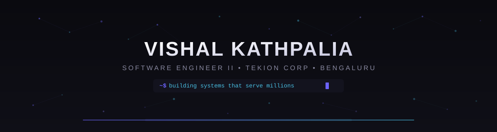
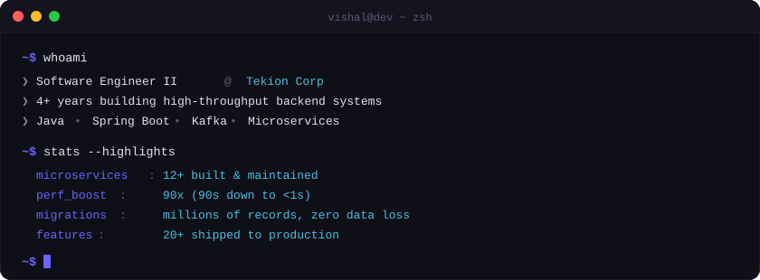
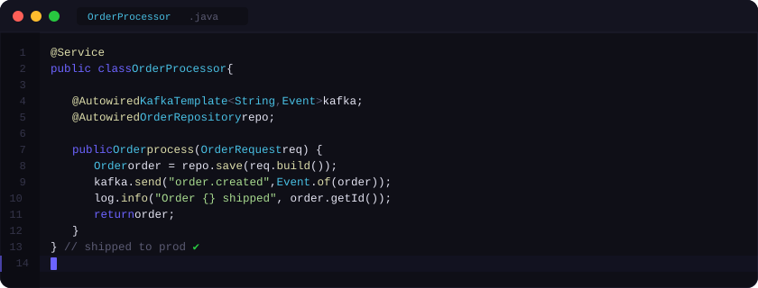

<!-- ======================== VISHAL KATHPALIA ======================== -->



<!-- Animated Typing -->
<p align="center">
  <a href="https://vishalkathpalia.qzz.io">
    
  </a>
</p>

<!-- Social Badges -->
<p align="center">
  <a href="https://vishalkathpalia.qzz.io"></a>&nbsp;
  <a href="https://www.linkedin.com/in/vishalkathpalia"></a>&nbsp;
  <a href="mailto:vishalkathpalia0@gmail.com"></a>
</p>

<p align="center">
  
</p>

---

<!-- Terminal About -->
<p align="center">
  
</p>

---

## 📈 Impact

<p align="center">
  
</p>

---

## ⚡ Tech Stack

<p align="center">
  
</p>

<br/>

<details>
<summary>&nbsp;<b>Expand full breakdown</b></summary>
<br/>

| | Category | Technologies |
|---|----------|-------------|
| 🏗 | **Languages** | Java, Python, C++ |
| ⚙️ | **Backend** | Spring Boot, Spring Framework, Hibernate, REST APIs, Microservices |
| 📡 | **Messaging & Streaming** | Apache Kafka, Event-Driven Architecture, CDC Pipelines, Async Processing |
| 🗄 | **Databases** | MySQL (Query Optimization), MongoDB (Schema Design), Elasticsearch (Search & Indexing), Redis (Caching) |
| 🐳 | **DevOps & Infra** | Docker, Kubernetes, Linux, CI/CD, Bash |
| 🧠 | **Architecture** | High-Level Design (HLD), Low-Level Design (LLD), System Design, Domain-Driven Design |

</details>

---

## 🚀 Journey

<p align="center">
  
</p>

---

## 🎯 Skill Proficiency

<p align="center">
  
</p>

---

## 👨‍💻 What I Build

<p align="center">
  
</p>

<p align="center">
  <sub>The kind of code I write daily — Spring Boot services, Kafka event pipelines, clean architecture.</sub>
</p>

---

## 📊 GitHub Stats

<p align="center">
  
  &nbsp;&nbsp;
  
</p>

<p align="center">
  
</p>

<br/>

<!-- Activity Graph -->


---

## 🔮 Currently

- Integrating **LLMs & Spring AI** into production at Tekion — making automotive retail software smarter
- Designing **event-driven architectures** for real-time data sync across services
- Deepening **distributed systems** expertise — concurrency patterns, fault tolerance
- Building side projects that push into new problem spaces

---

## 💡 How I Engineer

```
→ Design for failure before designing for success
→ If it can't be measured, it can't be optimized
→ The best code is the code you never have to debug at 3 AM
→ Ship it, then iterate — perfect is the enemy of production
```

---

<!-- Random Dev Quote -->
<p align="center">
  
</p>

---

<details>
<summary>&nbsp;🔍&nbsp;<b>You found something</b></summary>
<br/>
<p align="center">
  <i>You're the kind of person who reads source code for fun.</i><br/><br/>
  <i>I respect that. Head over to my <a href="https://vishalkathpalia.qzz.io">portfolio</a>, open the terminal (press <code>`</code>), and type <code>help</code>.</i><br/>
  <i>There are games, easter eggs, and secrets hidden inside. Good luck.</i>
</p>
<br/>
</details>

---


<p align="center">
  <sub>Explore the full story at <a href="https://vishalkathpalia.qzz.io"><b>vishalkathpalia.qzz.io</b></a> — I hid games and easter eggs inside. Good luck finding them all.</sub>
</p>
